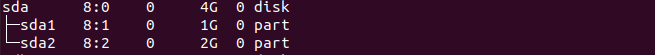
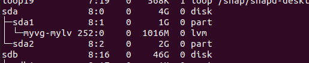
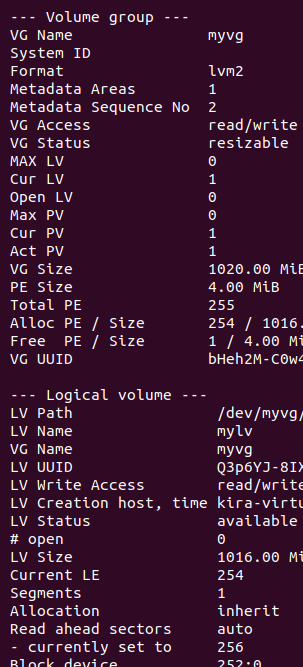

# Lab 2: Disk Management and Logical Volume Setup
Attach a new 6 GB disk to your virtual machine.

Begin by creating two partitions: 2 GB, and 3 GB.

Initialize the 2 GB partition as a Volume Group (VG) and create a Logical Volume (LV) within it.

Extend the Logical Volume by adding the 3 GB partition to the existing Volume Group.

----

After attaching the disk and creating the partitions:

- I have attached 4 GB.



Create a Volume Group and Logical Volume
```bash
sudo pvcreate /dev/sda1
sudo pvcreate /dev/sda2
sudo pvdisplay 
sudo vgcreate myvg /dev/sda1
sudo lvcreate -n mylv -L 1G myvg
sudo vgextend myvg /dev/sda2
sudo lvextend -L +2G /dev/myvg/mylv
sudo mkfs.ext4 /dev/myvg/mylv
```
list the partitions
```bash
lsblk
```


list the Logical Volume and Volume Group
```bash
sudo vgdisplay
sudo lvdisplay
```

