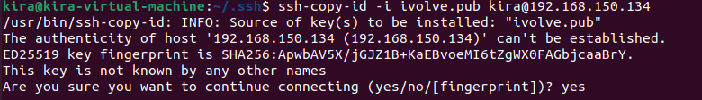
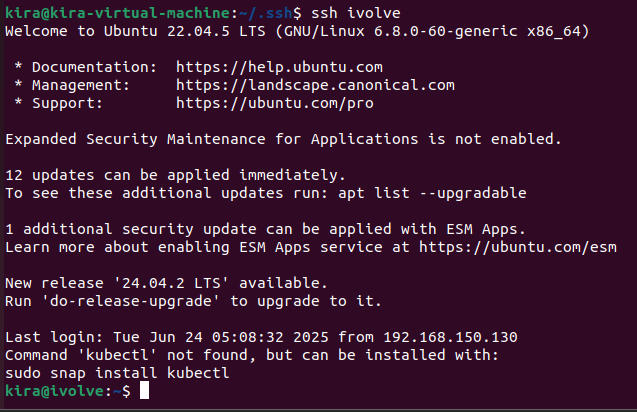

# Lab 3: SSH Configurations
Generate public & private keys in your local machine.

Securely transfer the public key to another machine using ssh-copy-id command.

Configure SSH to just run 'ssh ivolve' to access the remote machine.

----
Generate Keys:
```bash
ssh-keygen -t rsa -b 2048 -f ~/.ssh/ivolve
```

Transfer Public Key:
```bash
ssh-copy-id -i ~/.ssh/ivolve.pub kira@remote_machine_ip
```


Test Key Transfer:
```bash
ssh -i ~/.ssh/ivolve kira@remote_machine_ip
```
Configure SSH:
```bash
echo "Host ivolve
    HostName remote_machine_ip
    User kira
    IdentityFile ~/.ssh/ivolve" >> ~/.ssh/config

chmod 600 ~/.ssh/config
```

Test SSH Connection:
```bash
ssh ivolve
```
