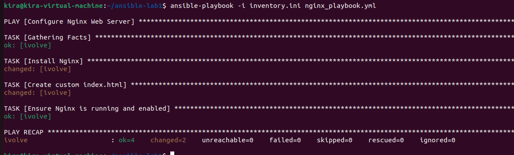

# Lab 5: Ansible Playbooks for Web Server Configuration
Write an Ansible playbook to automate the configuration of a web server.

Install Nginx.

Customize the web page.

Verify the configuration on managed node.

---
after creating [playbook](nginx-playbook.yml) file and [inventory](inventory.ini) run the following command to execute it:
```bash
ansible-playbook -i inventory.ini playbook.yml
```
Output will be similar to the following image:
