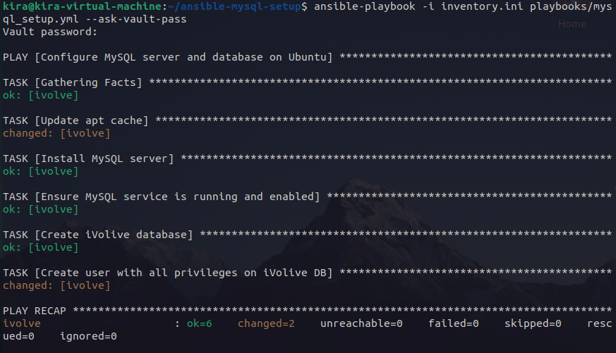
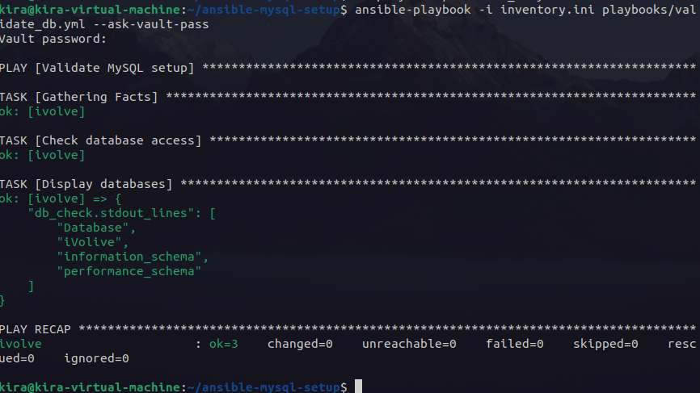

# Lab 7: Ansible Vault
Write Ansible playbook to automate the following tasks:

Install MySQL.

Create iVovie database.

Create user with all privileges on iVolve DB.

Use Ansible Vault to encrypt sensitive information such as database user password.

Validate DB on managed node by connecting to database using the created user and listing databases.

---

## Structure

```bash
lab-7/
├── inventory.ini
├── playbooks
│   ├── mysql_setup.yml
│   └── validate_db.yml
└── vars
    └── secrets.yml # i will add my values here
```
run this
```bash
ansible-vault create vars/secrets.yml
```

Then add your  info:
```yaml
---
mysql_root_password: 
mysql_ivolive_user: 
mysql_ivolive_password: 
```

run those commands:
```bash
ansible -i inventory.ini playbooks/mysql_setup.yml --ask-vault-pass
```



Then run this to validate:
```bash
ansible -i inventory.ini playbooks/validate_db.yml --ask-vault-pass
```

