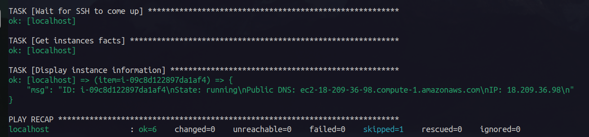
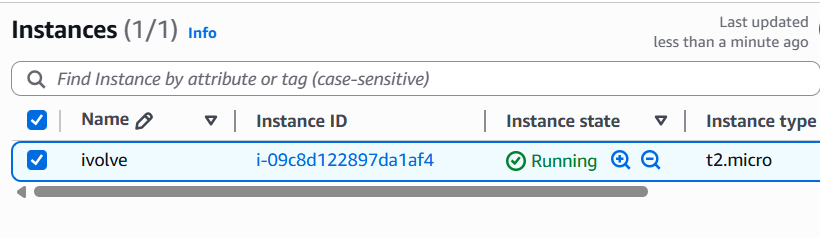
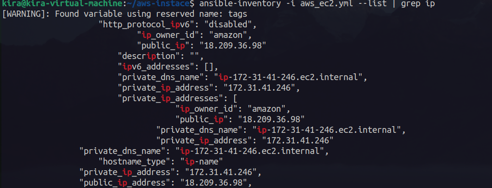

# Lab 8: Ansible Dynamic Inventories
Create AWS EC2 with tag name:ivolve.

Set up Ansible dynamic inventories to automatically discover and manage running EC2s with tag name=ivolve.

List the target hosts in Dynamic inventory using ansible inventory command.

---

install pip3 boto3 amazon.aws 

```bash
pip3 install boto3 
ansible-galaxy collection install amazon.aws
```
# Create a dynamic inventory file for AWS EC2 instances
Create a file named `aws_ec2.yaml` in your Ansible project directory with the following content:

```yaml
plugin: amazon.aws.aws_ec2
regions:
  - us-east-1 
filters:
  tag:Name: ivolve
hostnames:
  - tag:Name
compose:
  ansible_host: public_ip_address
keyed_groups:
  - key: tags
    prefix: tag
    separator: '_'
```

created aws secrets
`group_vars/all/aws_secrets.yml`

```yaml
aws_access_key: YOUR_AWS_ACCESS_KEY
aws_secret_key: YOUR_AWS_SECRET_KEY
```
run this command after creating the file

```bash
ansible -i playbook.yml --tags create_ec2 --ask-vault-pass 
```


ec2 on aws console



run this for listing the target hosts in Dynamic inventory

```bash
ansible-inventory -i aws_ec2.yaml --list
```

