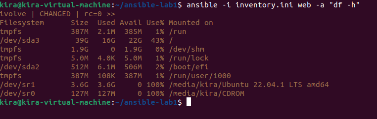

# Lab 4: Ansible Installation
Install and configure Ansible Automation Platform on control node.

Create inventory of a managed node.

Generate new key on control node.

Transfer the public key into managed node using ssh-copy-id command.

Perform ad-hoc command (check disk space) to check functionality.

---

## Install Ansible

```bash
sudo yum install ansible -y
```
## Configure Ansible inventory
```bash
mkdir -p lab-4
cd lab-4
touch inventory.ini
```

Edit `inventory.ini` file to be like this:


Generate Keys:
```bash
ssh-keygen -t rsa -b 2048 -f ~/.ssh/ivolve
```
Transfer Public Key:
```bash
ssh-copy-id -i ~/.ssh/ivolve.pub kira@192.168.150.134
```

ad-hoc command to check disk space:
```bash
ansible -i inventory.ini web -a "df -h"
```

