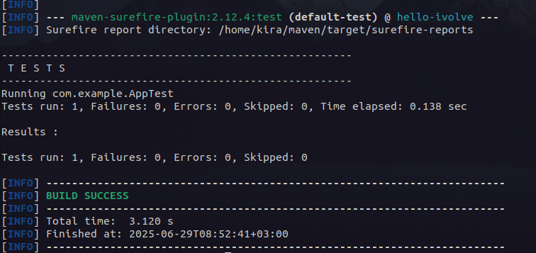
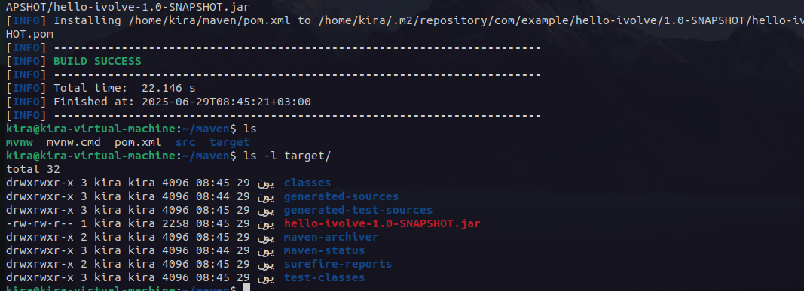
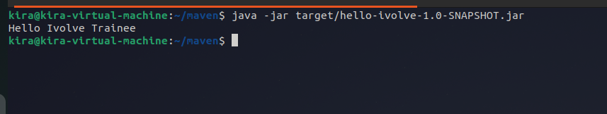

# Lab 10: Build Java App using maven
Install maven.

Clone source code https://github.com/lbrahim-Adel15/build2.git

Run Unit test.

Build App [generate Artifact (target/hello-ivolve-1.0-SNAPSHOT.jar)].

Run App.

Verify App is working.

---

first I will run docker image of maven to build the app
```bash
docker run -it --rm --name my-maven-project -v "$(pwd)":/usr/src/mymaven -w /usr/src/mymaven maven mvn wrapper:wrapper -Dmaven=3.8.6
```
this will create maven wrapper files in the current directory

then run the maven test command to run the unit tests
```
./mvnw test
```


for building the app 
```bash
./mvnw package
```


then run the app
```bash
java -jar target/hello-ivolve-1.0-SNAPSHOT.jar
```
