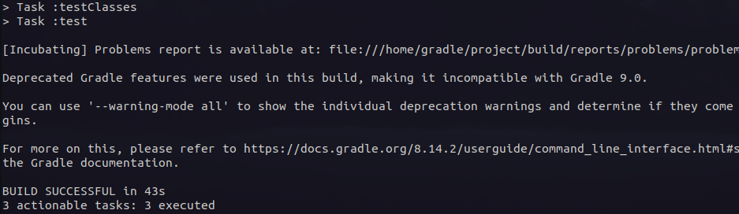
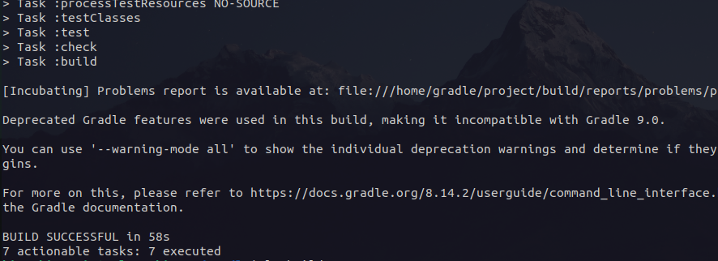
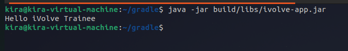

# Lab 9: Build Java App using Gradle
Install Gradle.

Clone source code https://github.com/Ibrahim-Adel15/build1

Run Unit test.

Build App [generate Artifact (build/libs/ivolve-app.jar)].

Run App.

Verify App is working.

---

After cloning the code I will use docker image for gradle to test and build the app:

Test:

```bash
docker run --rm -u gradle -v "$PWD":/home/gradle/project -w /home/gradle/project gradle:alpine gradle test
```



Build:

```bash
docker run --rm -u gradle -v "$PWD":/home/gradle/project -w /home/gradle/project gradle:alpine gradle build
```



Run:

```bash
java -jar build/libs/ivolve-app.jar
```


