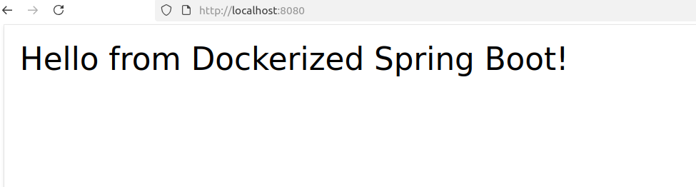
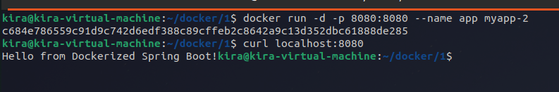
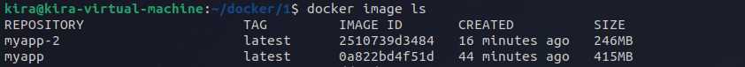

# Lab 11: Run Java Spring Boot App in a Container
Clone the Application Code
Repository: https://github.com/lbrahim-Adel15/Docker-1.git
Write Dockerfile
Use Maven base image with Java 17.
Create a working directory.
Copy the application code into the container.
Build the app using mvn package.
Run the app on the JAR file located at target/demo-0.0.1-SNAPSHOT.jar.
Expose port 8080.
Build Image.
Run Container.
Test the Application.
Stop and delete the container.
Repeat the steps, but build the application first before writing the Dockerfile.

---

run command 
```bash
docker build -t myapp-1 .
docker run -d -p 8080:8080 --name java-app myapp-
```



For the second part:
```bash
docker build -t myapp-2 .
docker run -d -p 8080:8080 --name java-app myapp-2
```


---
The diff size between both:

