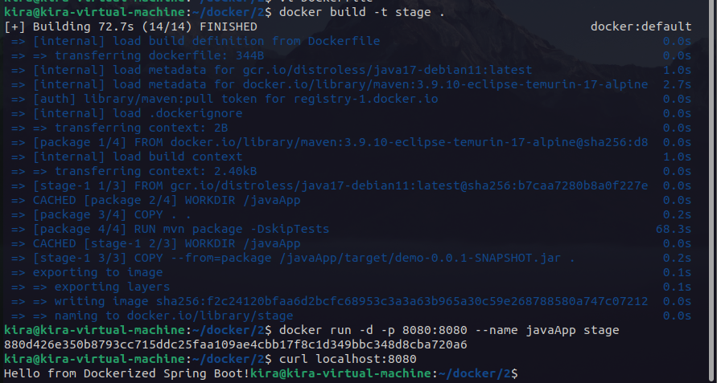

# Lab 12: Multi-Stage Build for a Node.js App
Clone the Application Code https://github.com/Ibrahim-Adel15/Docker-1.git
Write Dockerfile with Multi-stage.
Use Maven base image for first stag
Copy the application code into the container
Build the app using mvn package
Use java base image for second stag
Copy JAR file from first stag
Expose port 8080
Run the app
Build Docker Image.
Run the container.
Test the Application.
Stop and delete the container.
---

run command 
```bash
docker build -t stage .
docker run -d -p 8080:8080 --name javaApp stage
```
