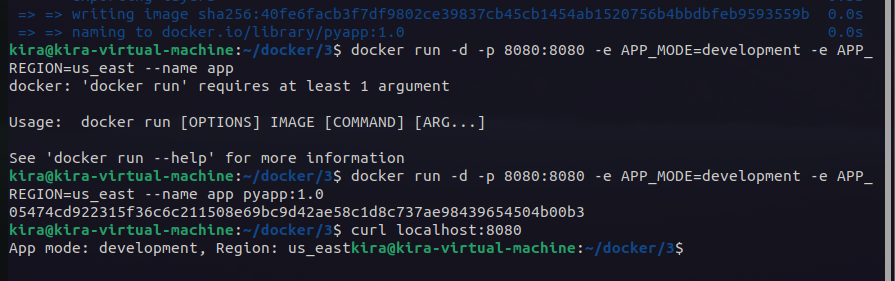
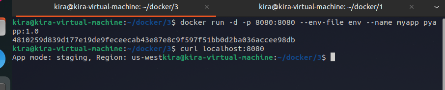
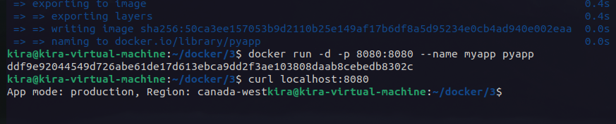

# Lab 13: Docker Environment Variables

Clone the Application Code https://github.com/lbrahim-Adel15/Docker-3.git

Write Dockerfile

Use python image

Install flask

Expose port 8080

Run python command on app.py ‘

Build Docker Image

Run container and set both environment variables (APP_MODE & APP_REGION) as following:
i.  (development, us-east) as variables in the command when run docker container
ii. (staging, us-west) in a separate file and pass the file name in the command
iii. - (production, canada-west) in the Dockerfile

---

in terminal run:
```bash
docker build -t pyapp:1.0 .
docker run -d -p 8080:8080 --name myapp -e APP_MODE=development -e APP_REGION=us-east pyapp:1.0
```



for second:
```bash
docker run -d -p 8080:8080 --name myapp --env-file env pyapp:1.0
```


for third:
```bash
docker build -t pyapp .
docker run -d -p 8080:8080 --name myapp pyapp
```
