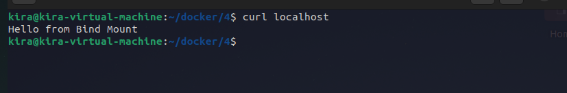
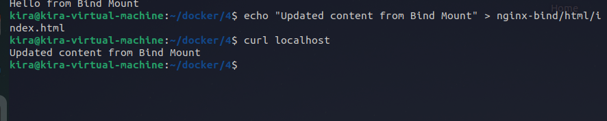
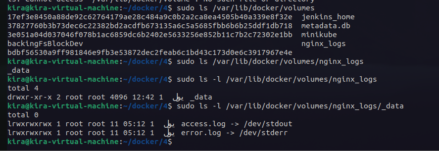

# Lab 14: Docker Volume and Bind Mount with Nginx

Create nginx_logs volume to persist Nginx logs and verify it in the default volumes path.
Create a directory nginx-bind/html to serve a custom HTML file from your host machine.
Create index.html file with “Hello from Bind Mount” syntax in nginx-bind/html| directory.
Run Nginx container with the following:
 Volume for /var/log/nginx 
 Bind Mount for /usr/share/nginx/html
Verify Nginx page by running curl command from your local machine.
Cha.nge in t_he index.html file in your local machine then verify Nginx page again.
Verify logs is stored in the nginx_logs volume.
Delete the volume.

---

to create vloume:
```bash
docker volume create nginx_logs
```
to create bind mount:
```bash
mkdir -p nginx-bind/html
echo "Hello from Bind Mount" > nginx-bind/html/index.html
```
to run Nginx container:
```bash
docker run -d --name nginx-container -v nginx_logs:/var/log/nginx -v ./nginx-bind/html:/usr/share/nginx/html -p 8080:80 nginx
```
to verify Nginx page:
```bash
curl http://localhost:8080
```


to change index.html:
```bash
echo "Updated content from Bind Mount" > nginx-bind/html/index.html
```


verify logs:
```bash
sudo ls -l /var/lib/docker/volumes/nginx_logs/_data/
```

