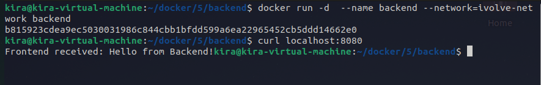

# Lab 15: Custom Docker Network for Microservices

Clone the frontend and backend Code https://github.com/lbrahim-Adel15/Docker5.git

Write Dockerfile for frontend and create image.
✓ Use python image
✓ Install packages in requirements.txt file
✓ Expose port 5000
✓ Run python command on app.py

Write Dockerfile for backend and create image.
✓ Use python image
✓ Install flask
✓ Expose port 5000
✓ Run python command on app.py

Create a new network called ivolve-network.

Run backend container using ivolve-network.

Run frontend container (frontend1) using ivolve-network.

Run another frontend container (frontend2) using default network.

Verify the communication between containers.

Delete ivolve-network.

---

create network

```bash
docker network create ivolve-network
```


create frontend and backend images:

```bash
cd frontend
docker build -t frontend  .
cd ../backend
docker build -t backend  .
```


create containers:

```bash
docker run -d --name backend --network ivolve-network backend
docker run -d --name frontend1 --network ivolve-network -p 5000:5000 frontend
docker run -d --name -p 5001:5000 frontend2 frontend
```
verify the frontend container in ivolve network :

```bash
curl localhost:5000
```



verify the frontend container in default network:

```bash
curl localhost:5001
```


