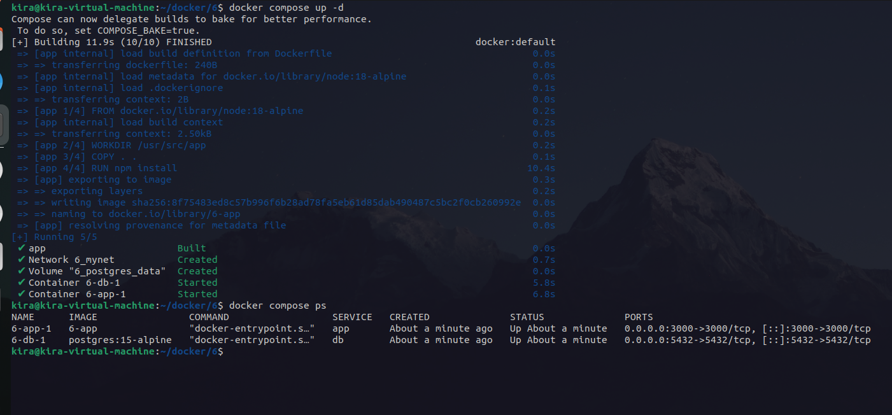

# Lab 16: Docker Compose for Node.js + PostgreSQL App

Clone source code and Dockerfile from:
https://github.com/lbrahim-Adel15/docker6.git

Write a docker-compose.yml file with:

App service (Node.js):

Build from Dockerfile

Expose port 3000

Depends on db service

Use mynet network

DB service (PostgreSQL):

Use postgres:15-alpine image

Port 5432

Environment variables:
POSTGRES_USER: postgres
POSTGRES_PASSWORD: postgres
POSTGRES_DB: postgres

Volume: postgres_data (/var/lib/postgresql/data)

Use mynet network

Volume: postgres_data

Network: mynet

---

run:

```bash
docker-compose up -d
```
# Check running containers
```bash
docker compose ps
```
