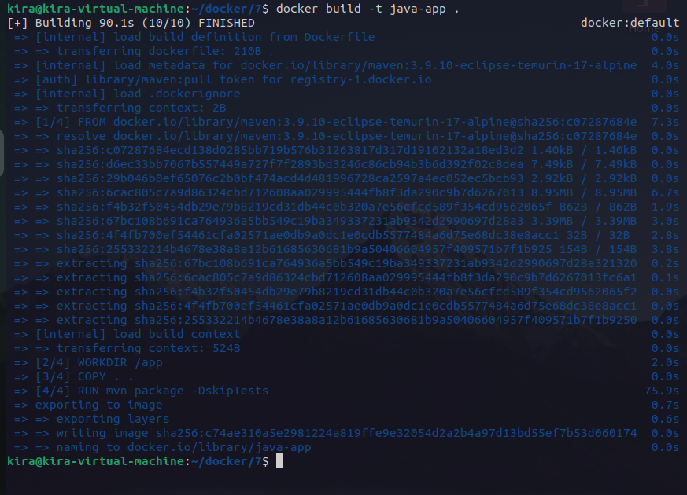
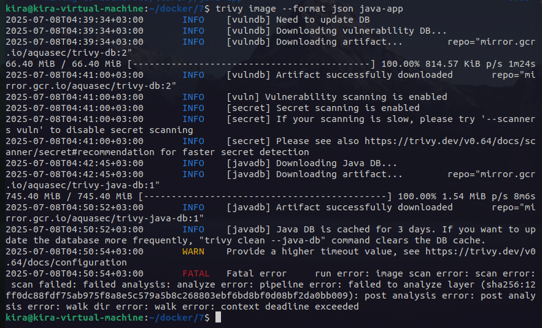

# Lab 17: Scan Docker Image with Trivy

Install Trivy from: https://trivy.dev/latest/getting-started/installation/

Clone the Application Code: https://github.com/lbrahim-Ade15/Docker-1.git

Write Dockerfile:
  - Use Maven base image.
  - Copy the application code into the container.
  - Build the app using mvn package.
  - Expose port 8080.
  - Run the JAR file located in target/demo-0.0.1-SNAPSHOT.jar.

Build Image.

Scan image and save the report in JSON format.

Push image to your DockerHub.

---

```bash
docker build -t java-app .
```


```bash
trivy image --format json -o trivy-report.json java-app
```


