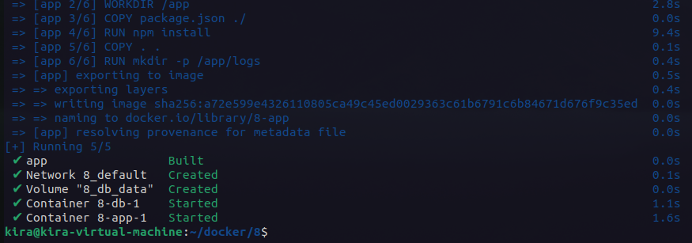
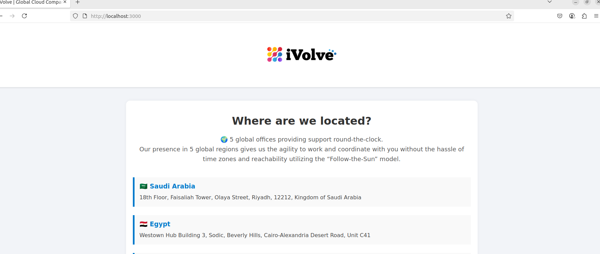

# Lab 18: Containerized Node.js and MySQL Stack Using Docker Compose

- Clone the application source code from https://github.com/Ibrahim-Adel15/kubernets-app

- The application requires a MySQL connection and must find a database named ivolv to start working.

- Create docker-compose.yml file with:
  - App service:
    - Build from the local Dockerfile 
    - Map port 3000
    - Use environment variables:
      - DB_HOST
      - DB_USER
      - DB_PASSWORD
  - db service:
    - Use MySQL image
    - Set environment variable MYSQL_ROOT_PASSWORD

  - db_data volume for /var/lib/mysql

- Verify app is working
- Verify app /health & /ready endpoints
- Verify app access logs at /app/logs/
- Push the Docker image to your DockerHub

---
after creating the docker-compose.yml file run the following command to start the services:

```bash
docker-compose up -d
```


check the page:

