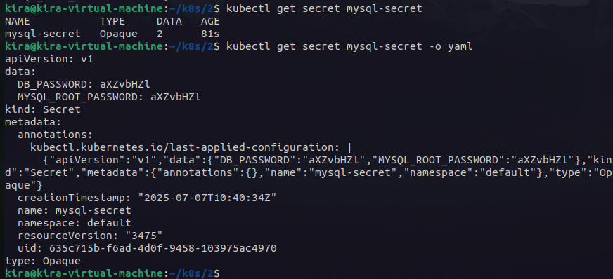

# Lab 21: Managing Configuration and Sensitive Data with ConfigMaps and Secrets
Define a ConfigMap to store non-sensitive MySQL configuration variables:

DB_HOST – The hostname of the MySQL StatefulSet service

DB_USER – The database user that the application will use to connect to the ivolve database.

Define a Secret to store sensitive MySQL credentials securely:

DB_PASSWORD – The password for the DB_USER.

MySQL_ROOT_PASSWORD – The root password for MySQL database.

Use base64 encoding for the Secret data values.

---

```bash
kubectl apply -f configmap.yaml
kubectl apply -f secret.yaml
```


