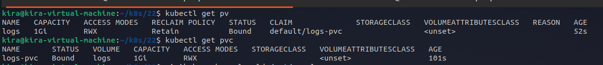

#  Lab 22: Persistent Storage Setup for Application Logging
• Define a Persistent Volume (PV) with the following specifications:
  o Size:1Gi
  o Storage type: hostPath
  o Path:/mnt/app-logs on the node file system (/mnt/app-logs must be created on app node with 777 permission)
  o Access mode: ReadWriteMany (to allow all replicas read/write access)
  o Reclaim policy: Retain 
• Define a Persistent Volume Claim (PVC) that requests 1Gi storage.
• Ensure the PVC access mode matches the PV (ReadWriteMany).

---

first create the directory on the app node:
```bash
minikube start --nodes=2
minikube ssh -n minikube-m02
mkdir -p /mnt/app-logs
chmod 777 /mnt/app-logs
```

then run the [PV](pv.yml) and [PVC](pvc.yml) files:
```bash
kubectl apply -f pv.yml
kubectl apply -f pvc.yml
```
Verify the PV and PVC
```bash
kubectl get pv
kubectl get pvc
```


