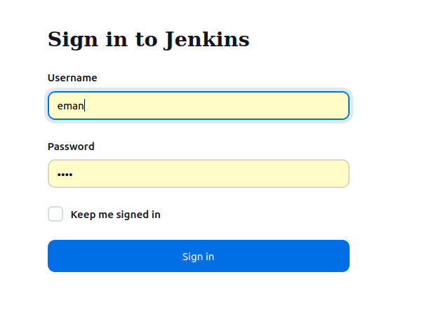

#  Lab 32: Jenkins Installation
 • Install Jenkins
    o OPTION 1: Install and configure Jenkins as a service.
    o OPTION 2: Deploy Jenkins as a container/pod

---

I installed Jenkins as a container using the following command:
```bash
docker run -d --name jenkins -p 8080:8080 -p 50000:50000 -v jenkins_home:/var/jenkins_home jenkins/jenkins:lts
```
