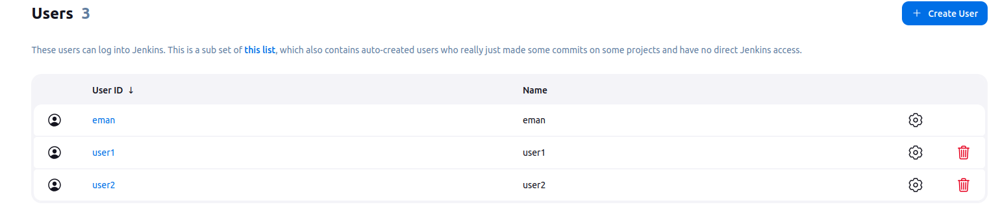
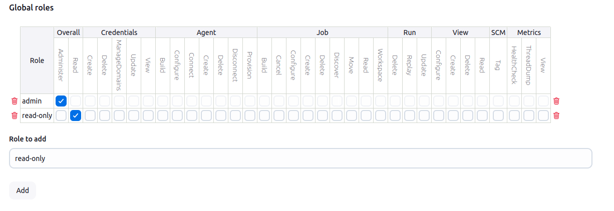
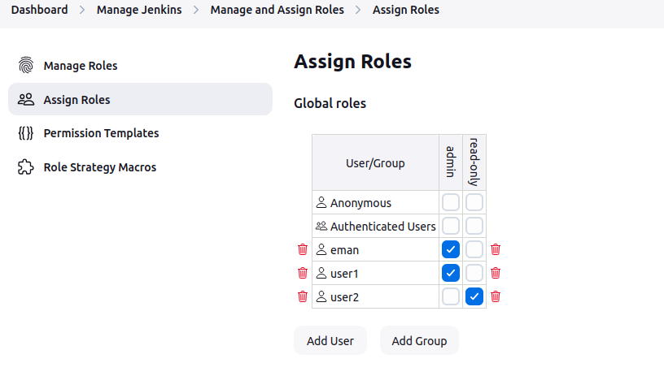

#  Lab 33: Role-based Authorization 

• Create user1 and user2.
• Assign admin role for user1 & read-only role for user2.

---

after installing Role based Authorization Strategy plugin, I created two users:

then I created two roles:

then I assigned the roles to the users:

