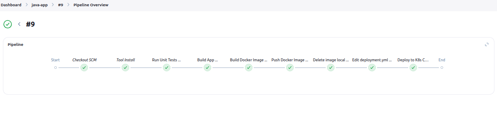
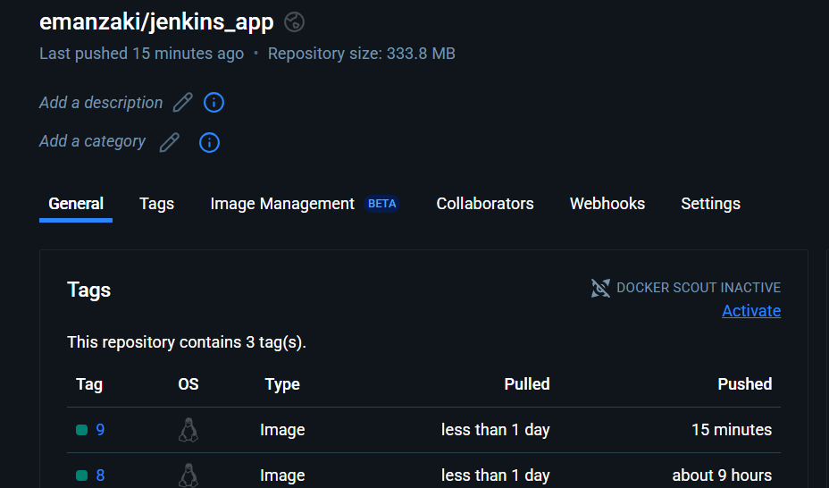

# Lab 34: Jenkins Pipeline for Application Deployment
 • Clone source code and Dockerfile from: https://github.com/Ibrahim-Adel15/Jenkins_App.git
 • Create a pipeline that automates the following processes:
 1. Run Unit Test
 2. Build App
 3. Build Docker image from Dockerfile in GitHub.
 4. Push image to Docker hub.
 5. Delete image locally.
 6. Edit new image in deployment.yaml file.
 7. Deploy to k8s cluster.
 • Set pipeline post action (always, success, failure)

 ---

I used minikube as a local Kubernetes cluster so to edit config file:
```bash
kubectl config view --raw > /home/kira/.kube/jenkins-config

sed -i "s|/home/kira/.minikube|/var/jenkins_home/.minikube|g' /home/kira/.kube/jenkins-config|g"
```

 and Docker so run this command to start jenkins as container:
```bash
docker run -d --name jenkins \
-v jenkins_home:/var/jenkins_home \
-v /var/run/docker.sock:/var/run/docker.sock \
-v /usr/bin/docker:/usr/bin/docker \
-v /usr/local/bin/minikube:/usr/local/bin/minikube \
-v /home/kira/.minikube:/var/jenkins_home/.minikube \
-v /home/kira/.kube/jenkins-config:/var/jenkins_home/.kube/config --network=host jenkins/jenkins:lts
```

then I will use a pipeline project and use [Jenkinsfile](./Jenkinsfile) from the repository.


the pipeline:



image pushed to Docker hub:



